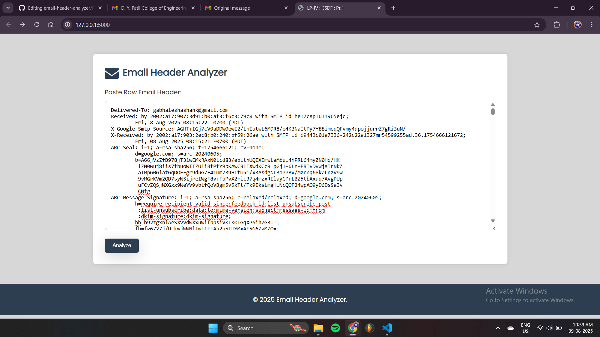
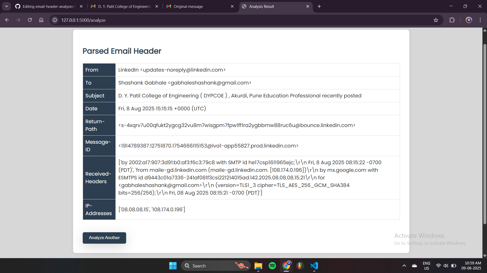

# Email Header Analyzer

A Flask-based web tool to analyze raw email headers, track email routing, and investigate potential email crimes.  
Developed as part of the **Cyber Security and Digital Forensics (CSDF)** curriculum.

# Features
- Paste and analyze raw email headers
- Extract IP addresses, routing details, and metadata
- Simple, clean, and responsive interface

# Installation
```bash\terminal  
git clone https://github.com/shashank7770/email-header-analyzer.git
cd email-header-analyzer
pip install -r requirements.txt
python app.py

# Screenshots


